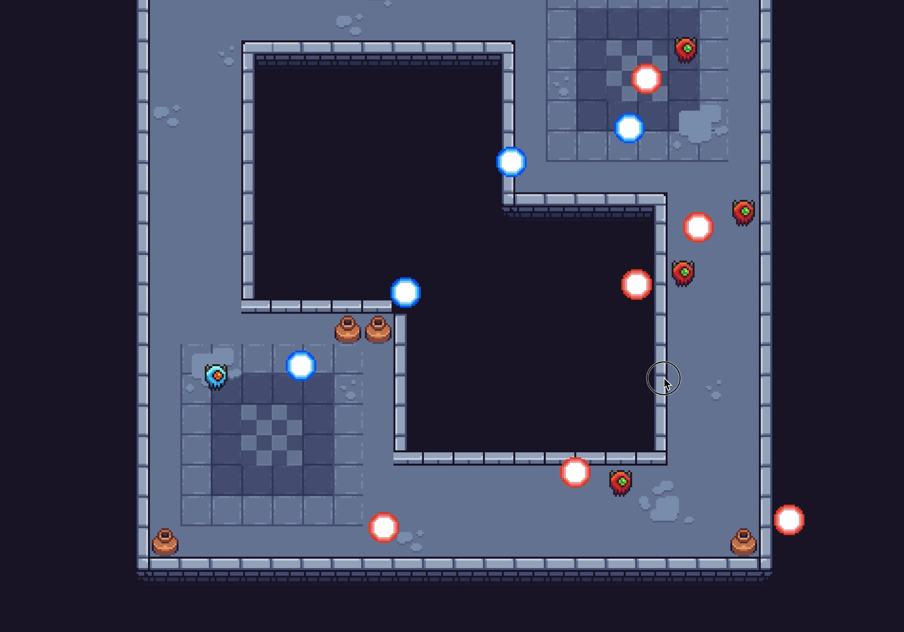

## About
This project was created for the COMP 2522 "Object-Oriented Programming" course at BCIT. 
It was created by Harlan Bullock and Finn Wylie

## Description
A fast-paced bullet-hell roguelike where you play as an individual known as a ‘Cryptophage’.
The goal is to make a game that emphasizes skill,

## Build instructions

These instructions assume the user is using the standard intelliJ setup for the COMP 2522 course.

1. After forking/cloning the repository to intelliJ open the Gradle panel on the right side of the screen.
2. Select \[term_project] > \[Tasks] > \[build] > \[build] to build the project.
3. After the project has built, in the same Gradle panel select \[term_project] > \[Tasks] > \[application] > \[run]
4. The game will open.

## Main Menu
- Click \[Play] to start a new game.
- Click \[Scores] to view the top 5 scores.
  - On death, your run's score will be saved to this leaderboard with a name of your choice.
- Click \[Dungeon] to view the experimental, unimplemented, dungeon generator.
- Click \[Quit] to exit the game.

## Gameplay
Move around the screen shooting enemies while avoiding being hit yourself. The game increases in difficulty as you clear 
more waves. On death, you will be shown your run's score \(number of kills you got) and a box to input your name.

#### Controls:
| Action     | Button       |
|------------|--------------|
| Move Up    | W            |
| Move Down  | S            |
| Move Left  | A            |
| Move Right | D            |
| Aim        | Mouse Cursor |
| Shoot      | Left Click   |

## Future Improvements

#### Game design improvements
- Add propper difficulty scaling
- Implement upgrades after n wave clears
- More enemy types
- Implement level generation system
- Smaller projectiles that are easier to dodge but harder to be accurate
- Enemy projectile hitboxes should be smaller than the sprite, feels good for the player 
- Player projectile hitboxes should be smaller than the sprite, feels good for the player

#### Code improvements
- Fix weird wall collisions in the physics system
- Investigate the causes of the frame drops
- Add delta time system for the physics, movement and projectiles
- Reduce visibility and mutability of Manager classes

## Bibliography
- Tutorial used for basic project start guide: https://youtube.com/playlist?list=PLVNiGun9focYT2OVFUzL30wUtOToo6frD&si=FQgnzmftUZgB8cQ0
- Referenced when making the dungeon generator: https://github.com/halftheopposite/bsp-dungeon-generator

## Original game idea \(out of scope):
#### Description:
A fast paced bullet-hell roguelike where you play as an individual known as a ‘cryptophage’. Essentially you are a time-shifting warlock with a connection to an eldritch titan. You are plundering the ruins of an ancient civilization to learn about your mysterious past.

There are three planned unique cryptophages to play as, Voidsent, Techknight and Incarnate, each with their own pool of unlockable abilities that you will gain as you progress your run. Each of these characters have unique stats, playstyles and backstories.

Throughout your run you will unlock new attacks, simple passive stat upgrades and more intricate or specific powerful buffs that will alter your playstyle each run.

You progress the game by unlocking new time-lines where you will be able to explore this ancient ruin during different periods of history each with their own unique set of paths, hazards and enemies.

The goal is to make a game that emphasizes skill, replayability and player agency that doesn’t fail to tell a unique and engaging story.

#### Epics:
- As a player I would like a fast-paced movement system that allows me to express my skill.
- As a player I would like unique character(s)/class(es) and functioning attacks/movesets so that the game feels replayable and keeps my engagement.
- As a player I want to be able to play through a stylized environment so I can immerse myself in the world of the game.
- As a player I want to fight more than one (2-3) unique enemy type so experiences combat can feel unique.
- As a player I want to choose upgrades to change how the game plays in a minor way so I can beat stronger enemies
